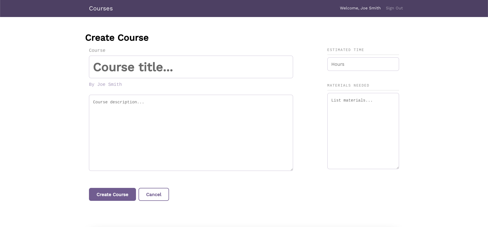

# Full-Stack application to manage a library of courses
 Full Stack application to administer a library of courses using React and a REST API.

 Signup page

Homescreen if not user signed in

Sigin page

Homescreen if a user has signed in

Create course page

Course detail page of a course that the signed in user owns

Course detail page of a course that is not owned by user

